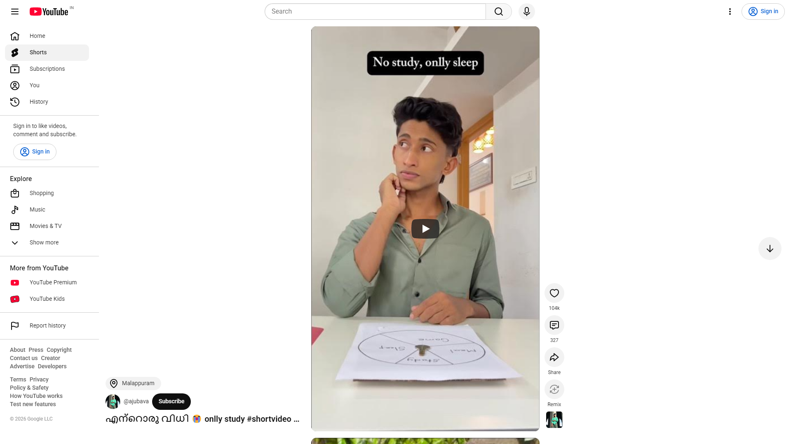
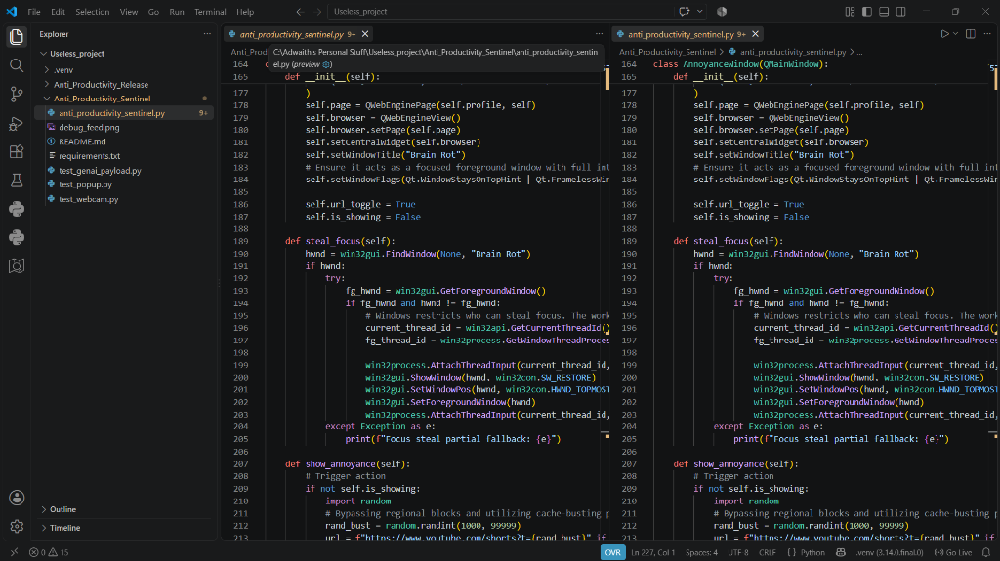
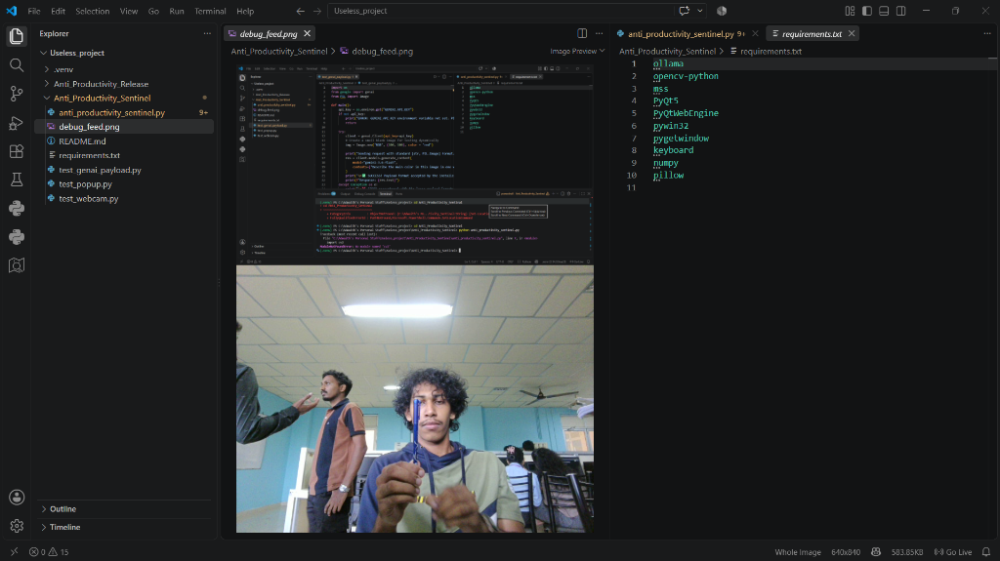
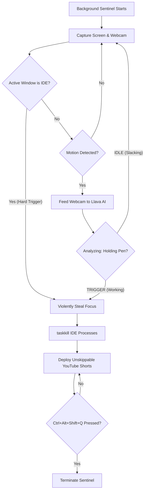

# Anti-Productivity Sentinel 🎯

## Basic Details
### Team Name: ORION

### Team Members
- Team Lead: Adwaith S A - College of Engineering Adoor
- Member 2: Abhin J Gomez - College of Engineering Adoor

### Project Description
An autonomous desktop surveillance agent that continuously monitors your screen and webcam to prevent you from doing any actual work. If it catches you opening an IDE or holding a Pen, it instantly force-closes your productive apps and aggressively takes over your desktop with a doomscroll feed.

### The Problem (that doesn't exist)
People are way too productive and have an unhealthy obsession with getting things done. We needed a reliable system that actively forbids the user from writing code or studying in peace.

### The Solution (that nobody asked for)
We built a ruthless sentinel using a local AI vision model (Llava) and OS-level window scanners. The moment it detects any productivity, it violently `taskkill`s your IDE (deleting unsaved work) and traps your screen in an infinite, inescapable YouTube Shorts loop until you mentally surrender and hit a hidden hotkey.

## Technical Details
### Technologies/Components Used
For Software:
- Python
- PyQt5, OpenCV, pygetwindow, mss, win32api
- Ollama (Llava vision model for physical object detection)
- Windows PowerShell

### Implementation
For Software:
# Installation
First, install the backend Ollama engine directly to your operating system to enable localized AI models:
```powershell
# Windows PowerShell installation
irm https://ollama.com/install.ps1 | iex
```

Then, install the required Python packages and pull the Llava vision weights:
```bash
pip install -r requirements.txt
ollama pull llava
```

# Run
```bash
python anti_productivity_sentinel.py
```

### Project Documentation
For Software:

# Screenshots

*What happens after the said requirements.*


*The QWebEngine pop-up dynamically hijacking the desktop layer with an inescapable un-closable YouTube Shorts feed.*


*Raw OpenCV debug payload confirming the pipeline successfully capturing physical workspaces and evaluating user posture via Llava.*

# Diagrams

*Architecture flow depicting how the Anti-Productivity Sentinel seamlessly evaluates physical and digital states to aggressively prevent you from working.*

### Project Demo
# Video
<video src="assets/demo1.mp4" controls="controls" style="max-width: 100%;"></video>

> *If your markdown viewer strips native video tags, **[click here to view the raw MP4 file](assets/demo1.mp4)**.*

*Live recording demonstrating the Sentinel tracking the webcam and immediately engaging the un-closable YouTube logic.*

## Team Contributions
- Adwaith S A: Engineered the core OS-level window monitoring, PyQt5 focus-stealing mechanics, and `taskkill` logic. Curated and generated massive custom visual datasets of study environments to help fine-tune the AI's physical object detection accuracy.
- Abhin J Gomez: Integrated the Llava multi-modal vision AI via Ollama, implemented the stealth `.pyw` deployment pipeline, and rigorously built hand-labeled datasets to calibrate the precise physical motion-thresholds for the Sentinel.

---
Made with ❤️ at TinkerHub Useless Projects 


